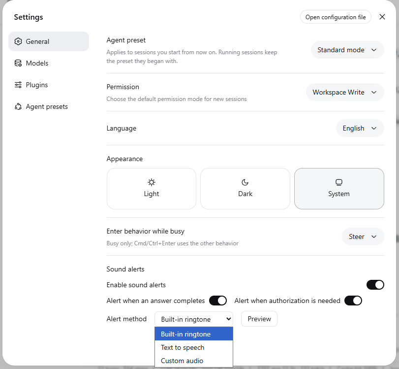

# @deepseek-ai/dsh-client-ui-notify

English | [中文](README.zh.md)

**Sound-alert plugin** for the web client: rings when a session's answer completes and when a session needs authorization, so a background conversation cannot finish unnoticed.
The browser half provides `ctx.notify` (a `NotifyRuntime`) and registers a preference row into the settings **General** section; the Host half exposes the durable `ui-notify` settings namespace the row reads and writes through `ctx.settingsScope`, stored in the user-settings document (`$DSH_HOME/settings.yaml` by default).

## Alert events

The runtime observes `ctx.sessions.list` and rings in two situations, both gated by the master switch and their own toggle:

- **Answer complete** — a session's `running` bit flips true → false (the sidebar's green "done" reminder, current session included).
- **Authorization needed** — a session's `pendingInteraction` appears (approval, plan review, or ask-user question).

The first list snapshot only records observed state (a session already idle at load rings nothing), and `connection/reset` re-baselines so reconnect status replay cannot ring.

## Alert methods

- **Built-in ringtone** — a two-tone chime synthesized at build time, embedded as a base64 data URI in the client bundle (`src/client/builtin-ringtone.ts`), so no extra asset route exists.
- **Text to speech** — `speechSynthesis.speak` reads the configured text aloud (skipped when the text is empty).
- **Custom audio** — plays an http(s) URL or a data URL, or a local file the row uploads to the host (≤ 1MB).
The uploaded file lands under `$DSH_HOME/storages/ui-notify/audio/`, read and written through the trust-fenced `/_dsh-ui-notify/audio/<id>.<ext>` webServer route (the same browser-trust fence as `/api`, loopback-only); the durable setting stores just the served URL — file bytes never enter the settings document.
Common audio formats are supported (wav, mp3, ogg, mp4, m4a, webm, aac, flac, aiff, wma, mid).

Playback degrades to a no-op when the platform capability is absent, so a misconfigured alert never throws from an event handler. The row's **Preview** button plays the current method immediately.

## Settings surface



The General settings row adds the **Enable sound alerts** master switch, the two event switches (**alert when an answer completes** / **alert when authorization is needed**), the **Alert method** selector, the method-specific **input** fields, and the **Preview** button. Every control writes exactly one field through the injected `setField` face; the row never touches the settings transport itself. The Host half registers the namespace only when the settings provider is composed, so a deployment without one shows no row and no namespace.

## Installation

**Quick start**: download `dsh-client-ui-notify-0.1.0-rc.7.zip` from this repository's `release/` directory, extract it, and run `install.ps1` on Windows to finish the install (it copies the plugin, writes the loader row, and prints the restart hint); or follow the manual copy below.

The plugin is a plain npm package (host half `lib/index.js` plus browser half `lib/client.js`); installing it needs no git, npm registry, or pnpm.
The `profiles/node_modules` directory under `$DSH_HOME` is the installation's module fallback, and every dependency this package needs (cordis, dsh-settings, the client runtime, …) is already in that closure, so a manual copy needs no dependency install.

1. Copy the plugin directory (`package.json` + `lib/`) to `$DSH_HOME/profiles/node_modules/@deepseek-ai/dsh-client-ui-notify/` (`$DSH_HOME` defaults to `~/.dsh`).
2. Append the loader row to `$DSH_HOME/profiles/web/cordis.patch.yml` (or the profile that serves the web UI):

   ```yaml
   - insert:
       - id: ui-notify
         name: '@deepseek-ai/dsh-client-ui-notify'
   ```

3. Restart `dsh web` and refresh the browser; the **Sound alerts** row appears under Settings → General.

To uninstall: delete the copied directory and the `ui-notify` rows from `cordis.patch.yml`.

Other installation methods:
Run `dsh plugin --profile web add <path-to>.tgz` from a `pnpm pack` tarball (still requires the mount row, and its dependencies resolve from the registry);
or, for a source checkout, copy the whole package into `packages/client/ui-notify` and rebuild (a bare `lib/` folder dropped into `packages/client/` is not a valid workspace member).
Note that `$DSH_HOME/profiles/node_modules` is healed on boot into symlinks over the installation's dependency closure: a manually copied real directory is safe only while this package stays outside that closure — adding it to a shipped bundle later means removing the copy in favor of the closure link.

## Model Experience

None, as the plugin plays browser sounds; nothing here reaches a model request.

#### KV Cache effect

None; this package neither assembles nor sends a provider request.

## Known Limitations and Deferred Work

- **User-audio route is loopback-only** — a LAN deployment that serves the browser through `trustedHosts` gets 403 on uploads/downloads (playback of http(s)/data URLs is unaffected); wiring the route into the trusted-host list is deferred.
- **Orphaned hosted files** — replacing a file deletes the previous one from the row, but a setting edited by hand (or an upload that never reached the row) can leave a file under `$DSH_HOME/storages/ui-notify/audio/`; no retention sweep exists yet.
- **TTS voices follow the browser** — no voice/rate/pitch controls exist; the text field is the only TTS input.
- **One text for both events** — the TTS method speaks the same text whether an answer completed or authorization is needed.
