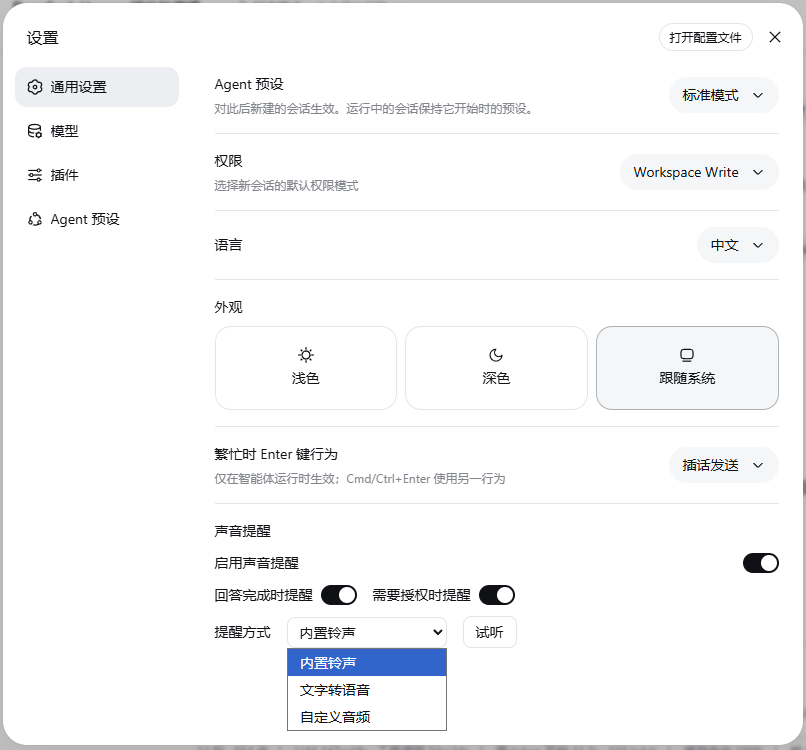

# @deepseek-ai/dsh-client-ui-notify

[English](README.md) | 中文

Web 客户端的**铃声提醒插件**：当某个会话的回答完成、或某个会话需要授权时播放声音，后台会话不会在无人注意时悄悄结束。
浏览器半部分提供 `ctx.notify`（`NotifyRuntime`）并把偏好行注册进设置页的**通用**分区；Host 半部分暴露该行通过 `ctx.settingsScope` 读写、持久化在用户设置文档（默认 `$DSH_HOME/settings.yaml`）中的 `ui-notify` 设置命名空间。

## 提醒事件

运行时观察 `ctx.sessions.list`，在两个情况下提醒用户，二者都受总开关和各自的开关控制：

- **回答完成** —— 某个会话的 `running` 位从 true 翻转为 false（侧边栏绿色“完成”提示，含当前会话）。
- **需要授权** —— 某个会话出现 `pendingInteraction`（审批、计划评审或 ask-user 提问）。

第一份列表快照只记录观察状态（加载时已空闲的会话不提醒），`connection/reset` 会重新建立基线，避免重连时的状态回放提醒。

## 提醒方式

- **内置铃声** —— 构建时合成的两声提示音，以 base64 数据 URI 内嵌进 client bundle（`src/client/builtin-ringtone.ts`），无需额外资源路由。
- **文字转语音** —— 用 `speechSynthesis.speak` 朗读配置的文字（文字为空时跳过）。
- **自定义音频** —— 播放 http(s) 链接或 data URL，或由行内文件选择器上传到宿主机的本地文件（≤ 1MB）。
上传的文件落在 `$DSH_HOME/storages/ui-notify/audio/` 下，经带信任围栏的 `/_dsh-ui-notify/audio/<id>.<ext>` webServer 路由读写（与 `/api` 相同的浏览器信任围栏，仅 loopback）；持久化设置只保存服务地址——文件字节永不进入设置文档。
支持常见音频格式（wav、mp3、ogg、mp4、m4a、webm、aac、flac、aiff、wma、mid）。

当平台能力缺失时播放退化为空操作，配置不当的提醒不会在事件处理器里抛错。行内的**试听**按钮立即播放当前方式。

## 设置界面


通用设置中添加**启用声音提醒**总开关、两个事件开关(**回答完成时提醒**/**需要授权时提醒**)、**提醒方式**选择器、各方式专属**输入框**和**试听**按钮。每个控件都通过注入的`setField`接口只写一个字段，行组件本身不接触设置传输层。Host 半部分仅在组合了设置提供方时注册命名空间，未组合的部署既不显示该行也不暴露该命名空间。

## 安装方法

本插件是普通 npm 包（Host `lib/index.js` + 浏览器`lib/client.js`），无需 git、npm registry 或 pnpm即可安装。
`$DSH_HOME` 下的 `profiles/node_modules` 是安装的模块回退目录，本插件需要的全部依赖（cordis、dsh-settings、client runtime 等）都已在那个闭包里，因此手动拷贝即可使用，无需再装依赖。

1. 把插件目录（`package.json` + `lib/`）复制到 `$DSH_HOME/profiles/node_modules/@deepseek-ai/dsh-client-ui-notify/`（`$DSH_HOME` 默认 `~/.dsh`）。
2. 在 `$DSH_HOME/profiles/web/cordis.patch.yml`（或负责提供 web UI 的 profile）追加挂载行：

   ```yaml
   - insert:
       - id: ui-notify
         name: '@deepseek-ai/dsh-client-ui-notify'
   ```

3. 重启 `dsh web`并刷新浏览器，**设置 → 通用设置** 中即出现「声音提醒」。

卸载方法：删除复制的目录与 `cordis.patch.yml` 里的 `ui-notify` 行。

其他安装方法：
用 `pnpm pack` 出的 tarball 执行 `dsh plugin --profile web add <路径>.tgz`（仍需挂载行，且其依赖要从 registry 解析）；
或
对源码 clone，把整个包放进 `packages/client/ui-notify` 后重新构建（只把 `lib/` 产物丢进 `packages/client/` 不是合法的 workspace 成员）。
注意 `$DSH_HOME/profiles/node_modules` 每次启动会按安装依赖闭包愈合为符号链接：手工拷贝的真实目录只在包未进入该闭包时安全——将来若把它加进随附 bundle，需删除拷贝、改用闭包链接。

## 模型体验

无，本插件只播放浏览器声音；没有任何内容进入模型请求。

#### KV 缓存影响

无；本包既不组装也不发送任何提供方请求。

## 已知限制与待办

- **用户音频路由仅限 loopback** —— 通过 `trustedHosts` 向局域网浏览器提供服务的部署在上传/下载时会收到 403（http(s)/data URL 播放不受影响）；把路由接入可信主机列表的工作待办。
- **孤儿托管文件** —— 更换文件时行内会删除旧文件，但手工编辑设置（或未写入设置的上传）可能遗留 `$DSH_HOME/storages/ui-notify/audio/` 下的文件；暂无回收机制。
- **TTS 音色跟随浏览器** —— 没有音色/语速/音调控件，文本框是唯一的 TTS 输入。
- **两种事件共用一段文字** —— 无论回答完成还是需要授权，TTS 方式朗读的都是同一段文字。
